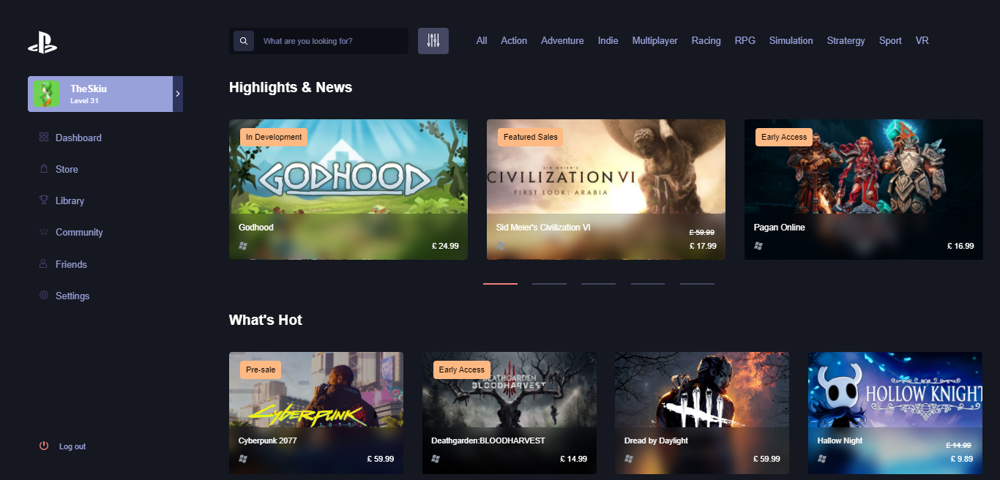
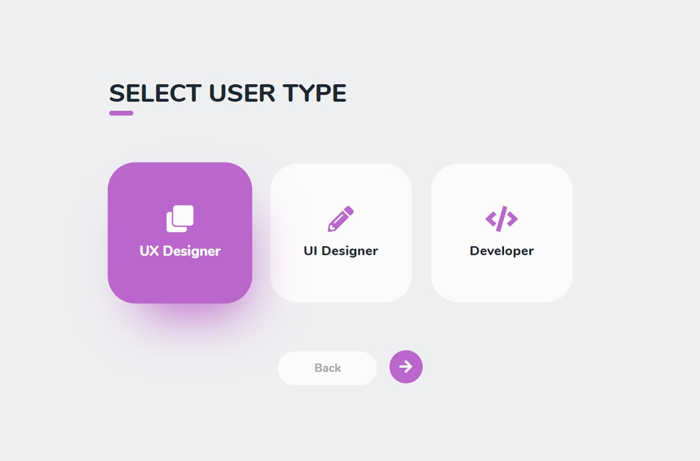

<h1 align="center"> Interfaces Clone</h1>
<h3 align="center"> README em construção</h3>

<p align="center">
 

  

  

  

  

</p>

&nbsp;

### Serie de projetos de clones de interfaces

Este repositório possui uma série de diretorios com projetos construídos principalmente em HTML e CSS para eu praticar e de alguma forma ajudar outras pessoas que estão aprendendo HTML e CSS.

## Menu

- [Rodando os projetos](#rodando-os-projetos)
- [Contribuições](#Contribuições)
- [Links](#links)
- [Licença](#licença)


## Tecnologias

- [HTML5]()
- [CSS3]() 
- [SASS]()
- [ReactJS](https://pt-br.reactjs.org/)
- [Styled Components](https://styled-components.com/)

&nbsp;

## Projetos nesse repositório


- [Mario Linkedin](#mario-linkedin)
- [Card Shoes](#card-shoes)
- [Disney UI](#disney-ui)
- [Form UI](#form-ui)
- [PlayGames Store](#play-game-store)
- [User Type](#user-type)

&nbsp;
&nbsp;

## Mario Linkedin

Linkedin do Mario desenvolvido a partir do layout criado pelo [Daniel Snows](https://dribbble.com/shots/5768210-Linkedin-Super-Mario-Concept)

&nbsp;


&nbsp;
&nbsp;

## Card Shoes

Card de apresentação de produtos criado inspirado em um layout da web

&nbsp;


&nbsp;
&nbsp;

## Disney UI

UI da Disney inspirado em um layout da internet

&nbsp;


&nbsp;
&nbsp;

## Form UI

Formulario inspirado em um layout da web

&nbsp;


&nbsp;
&nbsp;

## Play Game Store

Store inspirada em um layout da web

&nbsp;



&nbsp;
&nbsp;

## User Type

Radions button customizado inspirado em um layout da web

&nbsp;


&nbsp;
&nbsp;

## Rodando os projetos

Certifique-se de que você tenha o Git instalado na sua máquina, se não tiver baixe esse repositório em "Download ZIP".

1º- Clone o projeto como git:

```shell
git clone https://github.com/DaniloLima122/interfaces-clone
```

Obs: Alguns projetos foram criados com bibliotecas externas, para estes você precisará ter o Node.Js instalado, se não tiver vá até a seção [Links](#Links) e depois siga os passos abaixo.

2º - Instale as dependencias do projeto:

```shell
npm install
```

ou, se você usa o Yarn como gerenciador de pacotes é só digitar:

```shell
yarn install
```

4º - Abra a pasta que você clonou/baixou, no seu editor de preferência

5º - Agora, para rodar os projetos feitos só com HTML e CSS, é só abrir o arquivo HTML no seu navegador, e para rodar os projetos feitos com ReactJS digite o seguinte no seu terminal:

```shell
npm start
```

ou, se você usa o Yarn digite:

```shell
yarn start
```

## Contribuições

Fique a vontade para avaliar o repositório dando uma "star" ou contribuir com o projeto, quem sabe criando seus layouts e adicionando neste repositorio para ajudar outras pessoas que estão aprendendo principalmente CSS.

Você também pode reportar sobre bugs e dar sugestões de melhorias ou idéias de novos projetos, fique a vontade!!

## Links

- Instalação do [Git](https://git-scm.com/)
- Instalação do [Node.js](https://nodejs.org/en/download/)

## Licença

- [MIT](LICENSE)
